# NYCU_LLM — Large Language Models (535106), Fall 2025

A from-scratch tour of sequence modelling, walking the full architectural lineage that leads to
modern LLMs: **count-based n-grams → recurrent networks → self-attention → structured state
spaces → parameter-efficient adaptation of a pretrained 1B decoder.**

Every model in HW1 and HW2-1 is implemented directly in PyTorch (no `nn.Transformer`, no
`nn.MultiheadAttention`, no `s4` package). HW2-2 is the only assignment that starts from a
pretrained checkpoint, and even there only 0.07–0.45 % of the weights are ever updated.

| | Assignment | Core question | Headline result |
|---|---|---|---|
| **HW1-1** | [N-gram / RNN / LSTM](#hw1-1--from-counting-to-recurrence) | Does learned recurrence beat sparse counting? | LSTM PPL **43.63** vs. bigram **95.82** |
| **HW1-2** | [Transformer encoder](#hw1-2--a-transformer-encoder-written-from-scratch) | How many attention heads are actually useful? | 4 heads → **80.10 %** test accuracy |
| **HW2-1** | [SSM / S4](#hw2-1--state-space-models-recurrent-scan-vs-fft-convolution) | Is the FFT view of an SSM worth the algebra? | **≈11× faster per epoch** at higher accuracy |
| **HW2-2** | [LoRA on Llama-3.2-1B](#hw2-2--lora-fine-tuning-of-llama-32-1b) | Where in a Transformer does adaptation pay off? | attention-only saturates; **FFN unlocks the task** |
| *extra* | [RLHF sandbox](#rlhf-sandbox) | — | PPO scaffold on GPT-2 |

---

## Table of contents

- [Repository map](#repository-map)
- [Environment](#environment)
- [HW1-1 — From counting to recurrence](#hw1-1--from-counting-to-recurrence)
- [HW1-2 — A Transformer encoder written from scratch](#hw1-2--a-transformer-encoder-written-from-scratch)
- [HW2-1 — State space models: recurrent scan vs. FFT convolution](#hw2-1--state-space-models-recurrent-scan-vs-fft-convolution)
- [HW2-2 — LoRA fine-tuning of Llama-3.2-1B](#hw2-2--lora-fine-tuning-of-llama-32-1b)
- [RLHF sandbox](#rlhf-sandbox)
- [Cross-assignment synthesis](#cross-assignment-synthesis)
- [Data](#data)
- [Known deviations and caveats](#known-deviations-and-caveats)

---

## Repository map

```
.
├── hw1/                              # HW1 — classical & recurrent & attention LMs
│   ├── hw1_1_111705068.ipynb         #   n-gram + RNN + LSTM  (graded notebook)
│   ├── hw1_2_111705068.ipynb         #   Transformer encoder  (graded notebook)
│   ├── ngram_model.py                #   standalone bigram/trigram implementation
│   ├── n_gram_main.py                #   CLI driver: train, evaluate, generate
│   ├── RNN.py  /  LSTM.py            #   standalone recurrent LMs + trainers
│   ├── data/                         #   recipe corpus (.txt) + AG News subset (.csv)
│   └── outout/                       #   learning curves emitted by RNN.py / LSTM.py
│
├── hw2/
│   ├── hw2-1/hw2-1-111705068.ipynb   #   diagonal SSM + FFT-convolutional S4
│   └── hw2-2/hw2_2_111705068.ipynb   #   LoRA on Llama-3.2-1B, 3 target-module sets
│
├── RLHF/PPO.py                       # minimal TRL PPO loop on GPT-2 (self-study)
├── paper/                            # reference paper
├── assets/                           # figures reproduced in this README
└── pyproject.toml                    # uv-managed environment (Python ≥ 3.11)
```

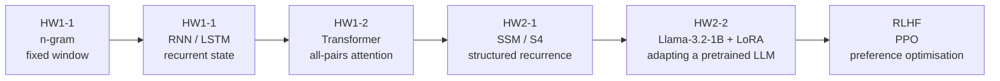

---

## Environment

```bash
uv sync                      # Python ≥ 3.11, torch ≥ 2.8, transformers ≥ 4.57
source .venv/bin/activate
```

`peft` and `trl` are needed for HW2-2 and the RLHF sandbox respectively and are not in
`pyproject.toml` (both were run on Colab / Kaggle):

```bash
uv pip install peft trl
```

HW1 runs comfortably on CPU or a laptop GPU. HW2-1 assumes CUDA (it uses
`torch.amp.autocast("cuda")`). HW2-2 needs ~8 GB of VRAM and a Hugging Face token with access to
`meta-llama/Llama-3.2-1B`.

---

## HW1-1 — From counting to recurrence

**Notebook:** [hw1_1_111705068.ipynb](hw1/hw1_1_111705068.ipynb) · **Scripts:**
[ngram_model.py](hw1/ngram_model.py), [RNN.py](hw1/RNN.py), [LSTM.py](hw1/LSTM.py)

### Task and data

Open-vocabulary next-word language modelling over a **recipe-instruction corpus**
(`hw1/data/train.txt`, 17,728,510 tokens, 38,404 word types). Evaluation is on
`hw1/data/test.txt`; `hw1/data/incomplete.txt` holds five sentence stems used as a qualitative
generation probe.

### Part A — Count-based n-grams

An unsmoothed maximum-likelihood estimator over sentence-marked token streams:

$$P(w_i \mid w_{i-n+1}^{\,i-1}) = \frac{C(w_{i-n+1}^{\,i})}{C(w_{i-n+1}^{\,i-1})}, \qquad
\mathrm{PPL} = \exp\!\left(-\frac{1}{N}\sum_{i} \log P(w_i \mid \text{context})\right)$$

Unseen contexts fall back to a hard probability floor of `1e-10` rather than to a proper
back-off or Katz/Kneser–Ney discount. This single design choice explains the result below.

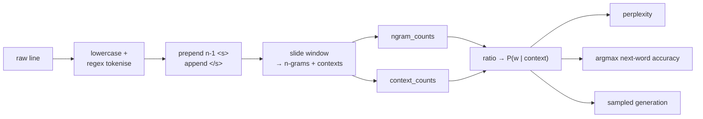

| Metric | Bigram (n=2) | Trigram (n=3) | Δ |
|---|---|---|---|
| Test perplexity | **95.82** | 177.25 | +84.98 % |
| Next-word accuracy | 27.07 % | **34.12 %** | +26.04 % |
| Distinct n-gram types | 660,108 | 2,573,019 | +289.8 % |
| Training (counting) time | 12.00 s | 17.45 s | +45.4 % |
| Peak system memory | ≈1.0 % | ≈5.7 % | ≈5.7× |

**The accuracy/perplexity inversion.** The trigram wins on top-1 accuracy — a longer context
disambiguates the next word — yet its perplexity is nearly twice as bad. These are not
contradictory: accuracy only asks whether the `argmax` is right, while perplexity integrates the
probability assigned to *every* reference token. The trigram spreads the same corpus mass over
3.9× more distinct events, so each seen event gets less mass, and every unseen test trigram is
charged $-\log(10^{-10}) \approx 23$ nats. Sparsity is punished by perplexity and rewarded by
`argmax`. **Smoothing is not a detail — it is the entire difference.**

Memory scales with the number of *distinct* n-grams, not with corpus size, which is why
$n{:}2 \to 3$ costs ~5.7× the RAM for the same 17.7 M tokens.

### Part B — RNN and LSTM language models

Both models share an identical data path so the only variable is the recurrent cell.
Vocabulary is frequency-pruned at `min_freq=3` → **15,843** types. Each training example is a
left-padded 50-token window predicting a *single* next token (the loss is applied to the last
time step only, not to the whole sequence), capped at 1 M windows.

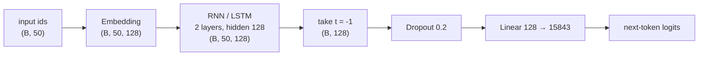

Shared hyper-parameters: embed 128, hidden 128, 2 layers, dropout 0.2, Adam @ 1e-3, gradient-norm
clip 5.0, batch 32, 10 epochs. The LSTM adds the cell state $c_t$ and the input/forget/output
gates; the RNN carries only $h_t$.

| Model | Test loss | Test accuracy | Test perplexity | Params |
|---|---|---|---|---|
| Vanilla RNN | 3.9018 | 31.60 % | 49.49 | ≈4.1 M |
| **LSTM** | **3.7758** | **33.30 %** | **43.63** | ≈4.5 M |

<p align="center">
  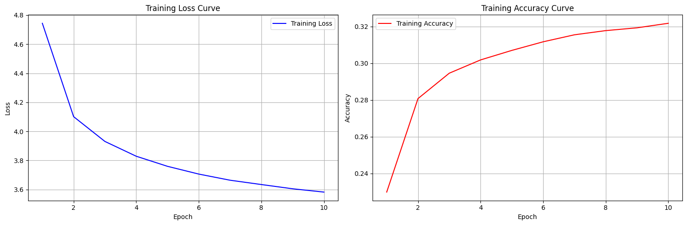
  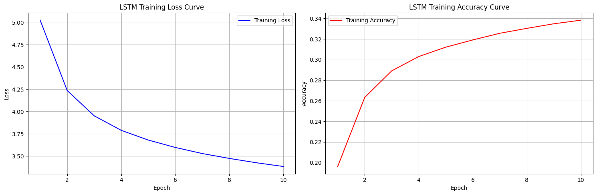
</p>
<p align="center"><em>Left: vanilla RNN. Right: LSTM. Neither curve has turned over — both are
still under-trained at epoch 10, so these numbers are a floor, not a ceiling.</em></p>

The LSTM is uniformly better (−0.126 loss, +1.7 pts accuracy, −5.9 perplexity) at ~10 % more
parameters. The gating machinery gives a gradient path that survives 50 unrolled steps, which the
additive-only RNN recurrence does not.

### Cross-family comparison

| | n-gram | RNN | LSTM |
|---|---|---|---|
| Context | hard window of $n-1$ | 50 tokens, decaying | 50 tokens, gated |
| Training | counting, $O(\text{tokens})$ | BPTT | BPTT + gates |
| Hardware | CPU, RAM-bound | GPU-preferred | GPU-preferred |
| Wall clock | 12–17 s | ≈60 s/epoch | ≈60 s/epoch |
| Failure mode | data sparsity | vanishing gradients | cost per step |

> **Do not compare the two perplexity columns directly.** The n-gram figure is a
> sentence-level score under an unsmoothed MLE with a `1e-10` floor over the full test set; the
> neural figure is `exp(mean token cross-entropy)` over a 15,843-word closed vocabulary on the
> capped window subset. The comparison that *is* valid is next-word accuracy (27.1 / 34.1 / 31.6 /
> 33.3 %), where the trigram is still competitive precisely because the neural models stopped
> early.

---

## HW1-2 — A Transformer encoder written from scratch

**Notebook:** [hw1_2_111705068.ipynb](hw1/hw1_2_111705068.ipynb)

### Task and data

4-way topic classification on an **AG News** subset (`World`, `Sports`, `Business`, `Sci/Tech`):
3,000 train / 250 validation / 2,000 test documents, truncated/padded to 32 tokens over a
whitespace-and-punctuation-stripped vocabulary.

### Architecture

Scaled dot-product attention and the encoder block are implemented by hand:

$$\mathrm{head}_h = \mathrm{softmax}\!\left(\frac{Q_h K_h^{\top}}{\sqrt{d_k}}\right) V_h,
\qquad \mathrm{MHA}(X) = W_O \,\bigl[\mathrm{head}_1 \Vert \cdots \Vert \mathrm{head}_H\bigr]$$

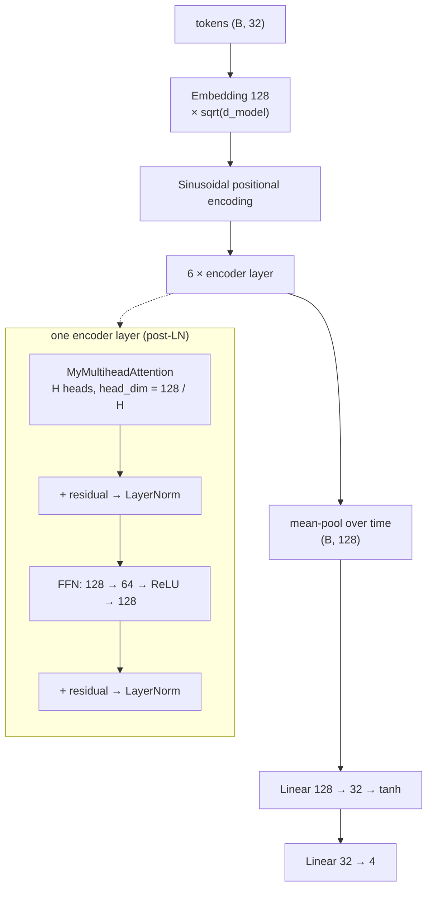

Trained with AdamW @ 1e-3, batch 64, 100 epochs, dropout 0.2 throughout.

### Head-count ablation

Total attention width is held constant at $d_{\text{model}} = 128$; only the partition changes,
so $H$ trades **per-head resolution** ($d_k = 128/H$) against **number of independent subspaces**.

| Heads $H$ | $d_k$ | Test loss | Test accuracy | Learning curve |
|---|---|---|---|---|
| 1 | 128 | 1.1433 | 78.85 % | 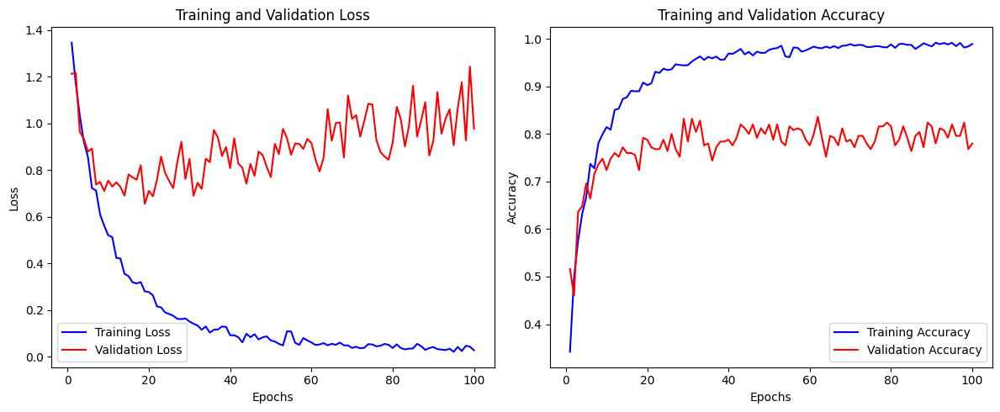 |
| **4** | **32** | 1.0379 | **80.10 %** | 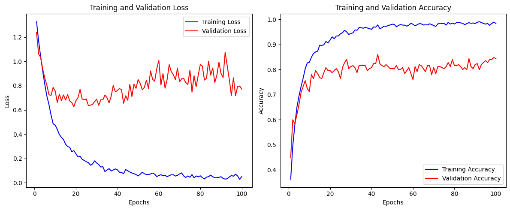 |
| 8 | 16 | **1.0345** | 78.80 % | 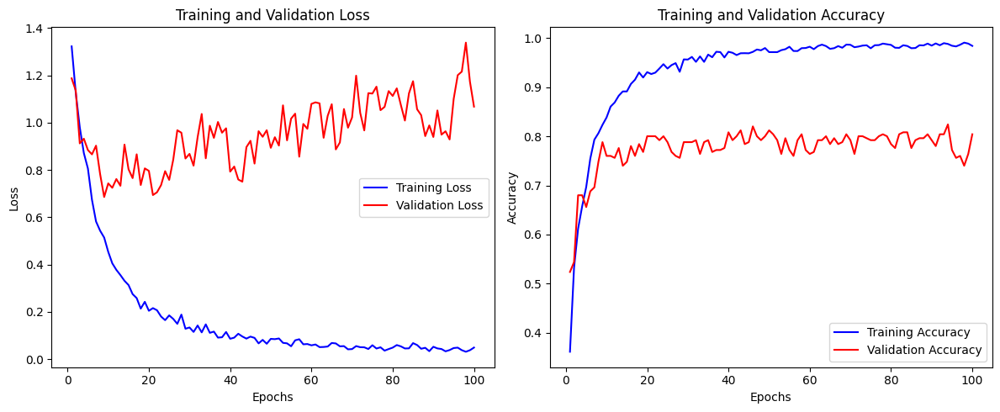 |

**Findings.**

1. **Multi-head helps, but only up to a point.** Going 1 → 4 heads buys +1.25 pts; going 4 → 8
   gives it all back. At $H{=}8$ each head sees a 16-dimensional subspace, which is too narrow to
   express a useful similarity metric on this vocabulary — the classic capacity-vs-diversity
   trade-off of multi-head attention.
2. **Loss and accuracy disagree at $H{=}8$.** $H{=}8$ has the lowest test loss but not the best
   accuracy: it is *better calibrated* on the examples it gets right while flipping a few
   borderline decisions. With only 2,000 test documents the 0.3-pt gap between $H{=}1$ and
   $H{=}8$ is inside the noise; the $H{=}4$ advantage is the only one worth reading.
3. **All three configurations overfit hard.** Training accuracy reaches 98.9 % while validation
   plateaus at ~78 % by epoch 10 and validation *loss rises monotonically* for the remaining 90
   epochs. A 6-layer, 128-dimensional encoder on 3,000 documents is heavily over-parameterised;
   early stopping around epoch 10–20 would give the same accuracy for 1/10 of the compute.

---

## HW2-1 — State space models: recurrent scan vs. FFT convolution

**Notebook:** [hw2-1-111705068.ipynb](hw2/hw2-1/hw2-1-111705068.ipynb)

### Task and data

14-way ontology classification on a **DBpedia-14** subset: 5,000 train / 2,000 validation /
2,000 unlabelled test abstracts, NLTK-tokenised, truncated to 64 tokens. Class imbalance is
handled with `compute_class_weight("balanced")` inside the cross-entropy loss; training uses AMP
and gradient-norm clipping at 1.0.

### The two formulations

A linear time-invariant state space model is defined in continuous time and then discretised with
a zero-order hold. With a **diagonal** $A$ this collapses to elementwise algebra:

$$h'(t) = A\,h(t) + B\,u(t), \quad y(t) = C\,h(t)
\;\xrightarrow{\text{ZOH}}\;
\bar A = e^{A\Delta}, \quad \bar B = \frac{e^{A\Delta} - 1}{A}\,B$$

$A$ is parameterised negative to keep the recurrence stable, and $\Delta$ is learnable.

The same system has two mathematically equivalent evaluation paths, and that is the whole point
of the assignment:

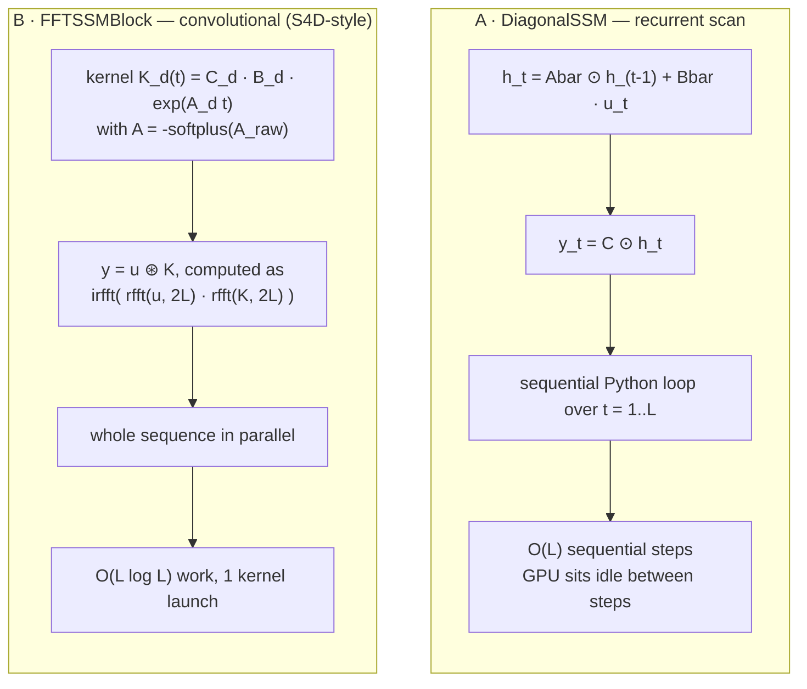

Both variants sit in the same residual block — `Linear` in, SSM, `Linear` out, sigmoid
self-gating, dropout, residual, `LayerNorm` — with mean pooling and a linear head on top.

### Results

| | Basic diagonal SSM | FFT-convolutional S4 |
|---|---|---|
| Evaluation | sequential scan, `for t in range(L)` | depthwise `rfft`/`irfft`, zero-padded to $2L$ |
| Asymptotics | $O(L)$ sequential | $O(L\log L)$ parallel |
| Epochs | 10 | 25 |
| Train accuracy | 0.7660 | **0.9120** |
| Validation accuracy | 0.5785 | **0.7140** |
| **Total wall clock** | **266.81 s** | **58.65 s** |
| Implied time / epoch | 26.7 s | 2.35 s |

<p align="center">
  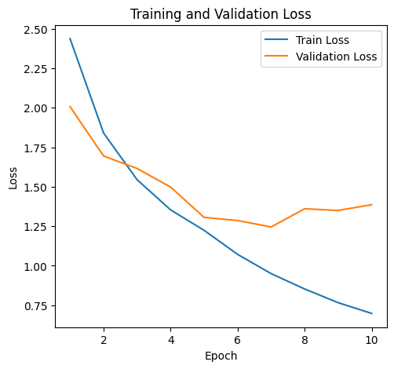
  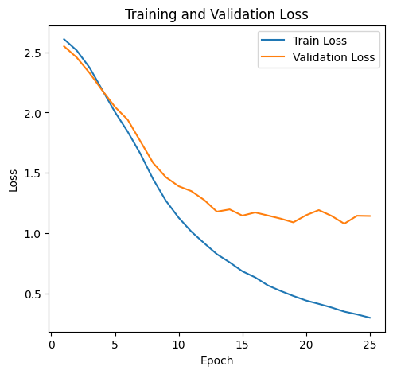
</p>
<p align="center"><em>Left: recurrent scan, 10 epochs. Right: FFT convolution, 25 epochs.</em></p>

**Why the ~11× per-epoch speedup.** The complexity improvement from $O(L)$ to $O(L\log L)$ is not
the dominant term at $L{=}64$ — $\log_2 64 = 6$, so FFT does *more* arithmetic. The win is
entirely about **parallelism and kernel-launch overhead**: the recurrent version issues 64
dependent Python-level GPU operations per layer per batch, each too small to saturate the device,
while the convolutional version resolves the whole sequence in a handful of batched FFT kernels.
This is exactly the argument S4 makes for training-time convolution and inference-time recurrence.

**Caveat on the accuracy column.** The two runs were not budget-matched (10 vs. 25 epochs), so
the +13.6-pt validation gap conflates architecture with training length. The timing comparison is
the clean result; the accuracy comparison is suggestive. Both runs show the same overfitting
signature — validation loss bottoms out and turns up while training loss keeps falling — which is
expected on 5,000 examples across 14 classes.

---

## HW2-2 — LoRA fine-tuning of Llama-3.2-1B

**Notebook:** [hw2_2_111705068.ipynb](hw2/hw2-2/hw2_2_111705068.ipynb)

### Task formulation

The dataset (`commonsense_15k.json`, 15,119 items) mixes several commonsense-QA formats —
true/false, 2-way, 4-way — under headings like `Answer1:`, `Solution1:`, `Ending1:`,
`Option1:`. Rather than asking the model to *generate* the answer key, the notebook reframes
multiple choice as **pointwise binary scoring**, which turns a heterogeneous generation problem
into one uniform classification problem:


15,119 questions expand to **46,475** labelled (question, option) pairs.

### Model surgery and adapter placement

`AutoModelForSequenceClassification` swaps Llama's `lm_head` for a randomly initialised
`score: Linear(2048 → 2)` head. `LoraConfig(task_type="SEQ_CLS")` then adds `score` to
`modules_to_save`, so the head is trained **densely** while the backbone is frozen and adapted
through low-rank updates:

$$W' = W + \frac{\alpha}{r}\,BA, \qquad B \in \mathbb{R}^{d\times r},\; A \in \mathbb{R}^{r\times k},\; r = 8 \ll \min(d,k)$$

with $r{=}8$, $\alpha{=}16$ (scaling 2.0), LoRA dropout 0.1, `bias="none"`.

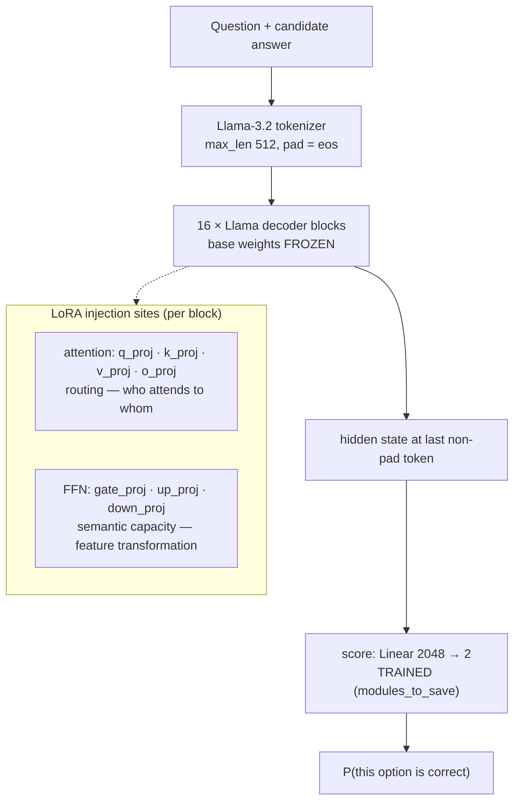

### Target-module ablation

Three placements were trained on the identical 90/10 split (batch 4 × grad-accum 4, lr 5e-5,
weight decay 0.01, 3 % warmup, fp16, best checkpoint by `eval_loss`):

| Setting | Target modules | Trainable | % of 1.24 B | Peak VRAM | Time/epoch | Best val loss | Reported accuracy |
|---|---|---|---|---|---|---|---|
| `attn_light` | `q, v` | 856,064 | 0.069 % | 7.7 GB | 24 min | 0.5140 | ≈0.49 |
| `attn_ffn_medium` | `q, k, v, up, down` | 3,805,184 | 0.307 % | 7.8 GB | 30 min | 0.4874 | > 0.60 |
| **`full_heavy`** | `q, k, v, o, up, down, gate` | 5,640,192 | 0.454 % | 7.9 GB | 33 min | **0.4831** | **> 0.60** |

<p align="center">
  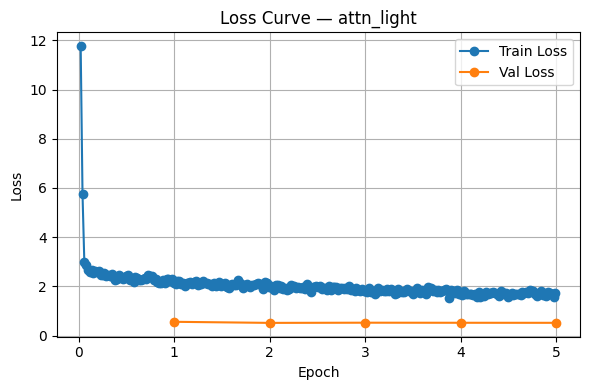
  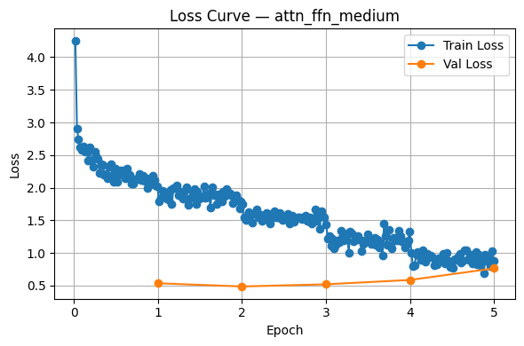
  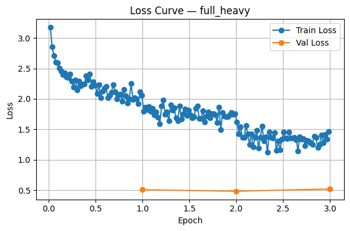
</p>
<p align="center"><em>Left → right: attn_light (5 ep), attn_ffn_medium (5 ep), full_heavy (3 ep).</em></p>

**Findings.**

1. **Routing alone is not enough.** `attn_light` flatlines: its validation loss is essentially
   constant from epoch 1 and downstream accuracy stays at ~0.49, i.e. chance on a binary task.
   Adapting *where the model looks* cannot by itself install a new decision function.
2. **The FFN is where the task gets learned.** Adding `up_proj`/`down_proj` moves accuracy above
   0.60. The MLP is the high-dimensional non-linear transform that carries factual and semantic
   features; the low-rank update needs to reach it to change what the representation *means*, not
   just what it attends to.
3. **Cost scales sub-linearly.** 6.6× more trainable parameters costs +0.2 GB VRAM and +38 %
   epoch time. LoRA memory is dominated by frozen base weights and activations, so the parameter
   count is close to free — there is little reason to be stingy with target modules at this scale.
4. **Best trade-off: `full_heavy`.** It reaches the lowest validation loss in 3 epochs where the
   lighter settings needed 5, so it also wins on total compute. It supplied the submitted
   `final_predictions.csv` over the 1,172-question ARC test set.
5. **All three overfit after epoch 2.** Validation loss bottoms out at epoch 2 in every run and
   rises afterwards (`attn_ffn_medium` goes 0.487 → 0.765 by epoch 5). `load_best_model_at_end`
   absorbs this, but the honest budget for this dataset is ~2 epochs.

---

## RLHF sandbox

**Script:** [RLHF/PPO.py](RLHF/PPO.py) — self-study, not a graded assignment.

A minimal `trl` PPO loop over GPT-2 with a value head and a frozen reference policy. The reward
is a deliberate placeholder — `len(response) * 0.01` — which stands in for a learned reward model
and makes the mechanics visible: the length reward is trivially hackable, and watching PPO
discover that is the pedagogical point.

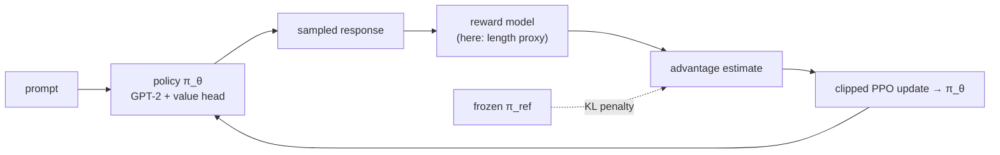

> Written against the pre-0.12 `trl` API (`PPOTrainer(config, model, model_ref, tokenizer)` and
> `PPOConfig(model_name=…)`). Current `trl` releases changed both signatures; the script needs
> porting before it will run on a fresh install.

---

## Cross-assignment synthesis

Reading the four assignments together, one theme recurs at every scale:

| Assignment | The bottleneck turned out to be… | …not what the obvious knob suggested |
|---|---|---|
| HW1-1 | probability smoothing | more context ($n{=}3$ hurt perplexity) |
| HW1-2 | regularisation / early stopping | more heads (8 was worse than 4) |
| HW2-1 | GPU parallelism & kernel launches | asymptotic complexity ($O(L\log L) > O(L)$ FLOPs at $L{=}64$) |
| HW2-2 | *where* parameters are adapted (FFN) | *how many* (0.45 % was plenty) |

Each time, the naive scaling axis — longer context, more heads, better big-O, more parameters —
was the wrong one; the payoff came from a structural choice orthogonal to it.

---

## Data

Large corpora are **not tracked** (see [.gitignore](.gitignore)). Recreate `hw1/data/` and the
HW2 JSON files from the course distribution before running anything.

| File | Size | Tracked | Used by |
|---|---|---|---|
| `hw1/data/train.txt` / `test.txt` | 93 MB / 23 MB | ✗ | HW1-1 (all models) |
| `hw1/data/incomplete.txt` | 1 KB | ✓ | HW1-1 generation probe |
| `hw1/data/{train,val,test}.csv` | ~1.7 MB | ✓ | HW1-2 (AG News subset) |
| `hw2/hw2-1/train.json` | 1.6 MB | ✗ | HW2-1 (DBpedia-14, 5,000 rows) |
| `hw2/hw2-1/{val,test}.json` | 1.2 MB | ✓ | HW2-1 |
| `hw2/hw2-2/commonsense_15k.json` | 7.3 MB | ✗ | HW2-2 (15,119 questions) |
| `hw2/hw2-2/test.csv` | 0.5 MB | ✓ | HW2-2 (1,172 ARC questions) |
| `pdf/` | ~28 MB | ✗ | course slides |

The HW2-1 notebook reads from Kaggle paths (`/kaggle/input/dataset-llm/…`); point `train_path`,
`valid_path` and `test_path` at `hw2/hw2-1/` to run locally.

---

## Known deviations and caveats

Documented rather than silently fixed, since the notebooks are the submitted artefacts.

1. **HW1-2 positional encoding indexes the batch axis.** `PositionalEncoding` stores `pe` with
   shape `(max_len, 1, d_model)` and returns `x + self.pe[:x.size(0)]`. With batch-first inputs
   `(B, L, D)` this slices by **batch size**, broadcasting one position vector across all
   timesteps of each sample instead of one per timestep. The encoder therefore operates on an
   effectively **order-agnostic bag of tokens** — which is consistent with the ~80 % ceiling on a
   topic-classification task that is largely solvable from lexical content alone. `max_len` is
   also passed as `embedding_dim` (128) rather than the sequence length.
2. **HW2-2 `pad_token_id` is set at inference but not at training.** `predict_with_lora_model`
   sets `base_model.config.pad_token_id`; `train_one_setting` does not.
   `LlamaForSequenceClassification` pools the last non-pad token, so the two paths can disagree
   about where the sequence ends. This is a plausible secondary contributor to `attn_light`
   stalling at chance.
3. **HW2-2 accuracy figures are external.** No `compute_metrics` is passed to the `Trainer`; the
   ~0.49 / > 0.60 numbers are downstream leaderboard scores, while `eval_loss` is the only metric
   computed in-notebook.
4. **HW1-1 n-gram uses no smoothing.** A `1e-10` floor, not Laplace / Katz / Kneser–Ney. The
   reported perplexities are therefore a property of that choice as much as of $n$.
5. **HW1-2 uses one-hot targets with `CrossEntropyLoss`.** Valid under PyTorch's
   probability-target overload and numerically identical to integer targets here, but the
   `argmax` round-trip in the training loop is redundant.
6. **HW2-1 runs are not budget-matched** (10 vs. 25 epochs) — see the caveat in that section.

---

<p align="center"><sub>National Yang Ming Chiao Tung University · 535106 Large Language Models · Fall 2025 · 111705068</sub></p>
